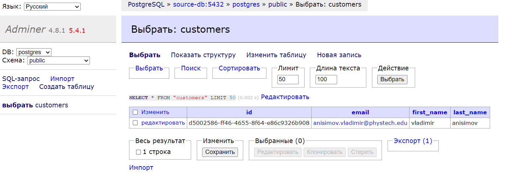
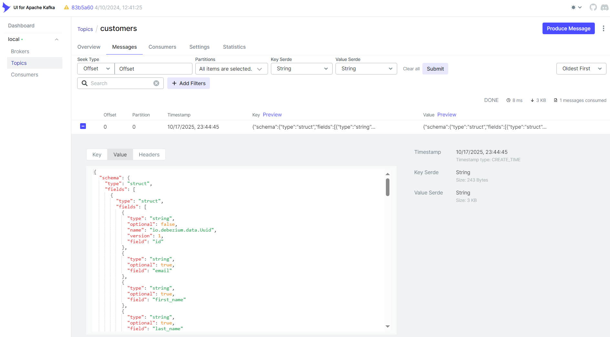
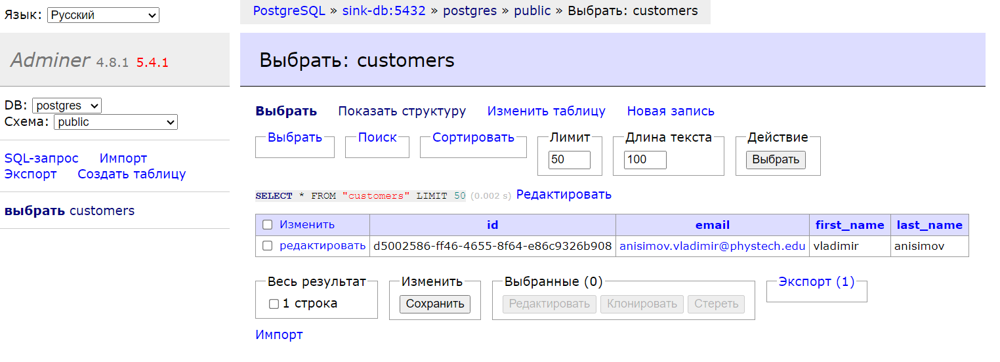

### Запуск приложения
1. Дождаться запуска контейнера debezium.
2. Загрузить конфигурацию debezium через curl:
   ```shell
    curl -i -X POST -H "Accept:application/json" -H  "Content-Type:application/json" http://localhost:8083/connectors/ -d @debezium/jdbc-sink.json

    curl -i -X POST -H "Accept:application/json" -H  "Content-Type:application/json" http://localhost:8083/connectors/ -d @debezium/source.json
    ```
   
3. Отправить запрос по эндпойнту `localhost:8080/api/v1/customers`:
    
4. Зайти в adminer `localhost:8032` и проверить наличие записи в таблице `customers`:
    ```
    source-db:5432
    postgres
    postgres
    postgres
    ```
    
5. Зайти в kafka-ui `localhost:8082` и проверить наличие автоматически сгенерированного debezium сообщения в топике `customers`:
    
6. Зайти в adminer `localhost:8032` и проверить успешную репликацию записи в таблицу `customers`:
    ```
    sink-db:5432
    postgres
    postgres
    postgres
    ```
   
