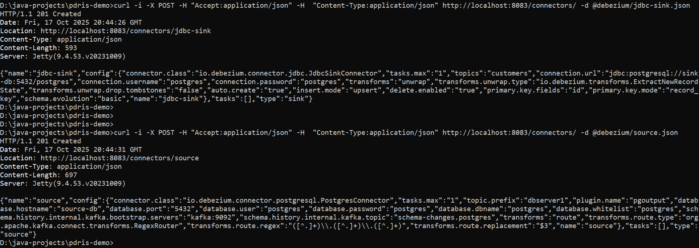
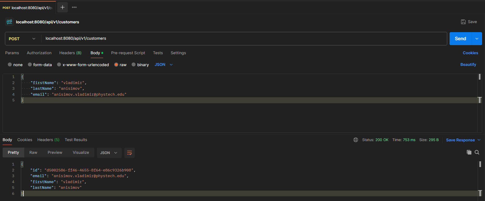

### Запуск приложения
1. Дождаться запуска контейнера debezium.
2. Загрузить конфигурацию debezium через curl:
   ```shell
    curl -i -X POST -H "Accept:application/json" -H  "Content-Type:application/json" http://localhost:8083/connectors/ -d @debezium/jdbc-sink.json

    curl -i -X POST -H "Accept:application/json" -H  "Content-Type:application/json" http://localhost:8083/connectors/ -d @debezium/source.json
    ```
   
3. Отправить запрос по эндпойнту `/api/v1/customers`:
    
4. 